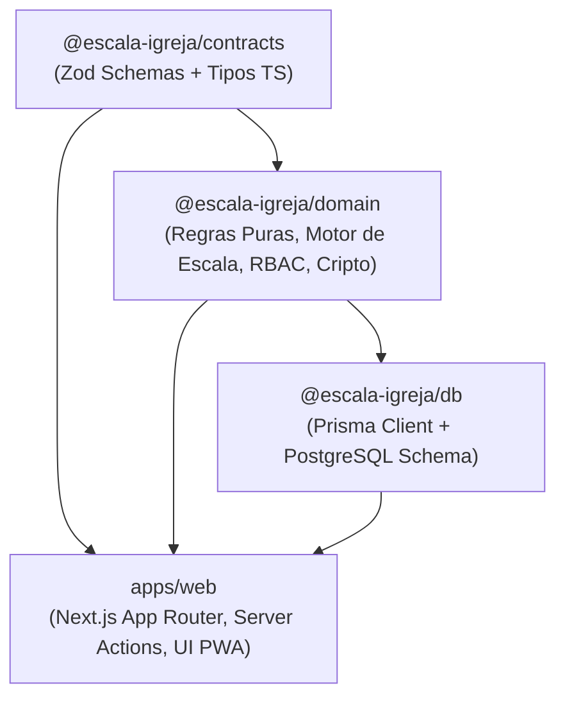

# Arquitetura do Monorepo — Escala Igreja

Este documento detalha o desenho arquitetural do monorepo do **Escala Igreja**, cobrindo fronteiras de pacotes, orquestração de tarefas, isolamento de regras puras e estratégia de cache.

---

## 1. Visão Geral e Estrutura de Diretórios

O monorepo utiliza **pnpm workspaces** aliado ao **Turborepo** para orquestração declarativa do grafo de dependências (DAG) e cache de compilação.

```text
escala-igreja/
├── apps/
│   └── web/                   # Next.js 15 (App Router, Server Actions, PWA, Capacitor)
├── packages/
│   ├── contracts/             # Schemas Zod e tipos TypeScript da API/domínio
│   ├── domain/                # Regras de negócio puras (DDD, zero I/O, zero framework)
│   └── db/                    # Camada de persistência (Prisma ORM, schema PostgreSQL)
├── docs/                      # Documentação arquitetural, requisitos e ADRs
├── .agent/                    # Regras, skills e contexto dos agentes de IA
├── turbo.json                 # Pipeline e cache declarativo do Turborepo
├── pnpm-workspace.yaml        # Declaração dos membros do workspace
├── tsconfig.base.json         # Configuração base de compilação TypeScript estrita
└── package.json               # Scripts unificados e orquestradores
```

---

## 2. Grafo de Dependências e Invariantes de Fronteira

O fluxo de dependências é **estritamente unidirecional e acíclico**:



### Invariantes de Isolamento:

1. **Pureza do Domínio (`@escala-igreja/domain`)**:
   - **Regra:** Nunca importa `@prisma/client`, `next`, `react`, `window`, `document` ou I/O de rede/disco.
   - **Propósito:** Permite que 100% da lógica de negócio (conflitos, limites, substituição autônoma, ranking, cálculo de datas, criptografia AES-256 e RBAC) execute de forma determinística e seja executada em qualquer plataforma (Node.js, edge, browser, Capacitor nativo).
   - **Testabilidade:** 274 testes unitários e de propriedades (`fast-check`) executam em ~1 segundo em memória, sem depender de banco de dados.

2. **Isolamento de Contratos (`@escala-igreja/contracts`)**:
   - **Regra:** Depende apenas de `zod`. Define a camada anti-corrupção (ACL) e esquemas de validação compartilhados entre o front-end, o back-end e eventuais clientes mobile externos.

3. **Encapsulamento de Persistência (`@escala-igreja/db`)**:
   - **Regra:** Encapsula o Prisma Client e o schema relacional otimizado para PostgreSQL. A aplicação web acessa o banco exclusivamente por este pacote ou pelos serviços em `apps/web/src/services`.

---

## 3. Pipeline de Tarefas e Estratégia de Caching (Turborepo)

O arquivo [`turbo.json`](../../turbo.json) orquestra a execução concorrente e incremental das tarefas:

| Tarefa | Dependência Topológica (`dependsOn`) | Caching | Saídas em Cache (`outputs`) |
|---|---|---|---|
| `build` | `^build` (constrói dependências antes) | Sim | `dist/**`, `.next/**`, `!.next/cache/**` |
| `typecheck` | `^build` (avalia tipos com dependências compiladas) | Sim | Log memoizado |
| `lint` | Nenhuma (paralelo) | Sim | Log memoizado |
| `test` | Nenhuma (Vitest com suites paralelas) | Sim | Execução em ~1.0s |
| `dev` | Nenhuma | Não (`cache: false`) | Processo de desenvolvimento persistente |

### Benefícios Práticos:
- **Build Instantâneo (*Full Turbo*)**: Quando nenhum código foi alterado, `pnpm typecheck` ou `pnpm build` responde em **20-40 ms**.
- **Invalidação Granular**: Se apenas um arquivo em `apps/web` for alterado, `contracts`, `domain` e `db` utilizam o cache instantaneamente sem reprocessamento.

---

## 4. Estratégia de Compilação TypeScript

1. **`tsconfig.base.json`**:
   - Centraliza `strict: true`, `noImplicitAny: true`, `moduleResolution: NodeNext` e checagens completas de nulos e índices.
2. **Project References (`tsc -b`)**:
   - Pacotes internos (`contracts`, `domain`, `db`) geram definições `.d.ts` e mapas `.d.ts.map` para consumo transparente e navegação rápida no editor.
3. **Next.js `transpilePackages`**:
   - Configurado no [`apps/web/next.config.ts`](../apps/web/next.config.ts) para permitir que o compilador do Next.js realize tree-shaking e empacotamento otimizado com First Load JS abaixo de 105 kB.

---

## 5. Prontidão para Mobile (Capacitor)

O monorepo está estruturado para suportar publicação nas lojas móveis sem bifurcação de código:
- Todo o código específico de UI web e Capacitor reside em `apps/web` com adaptação condicional em `apps/web/src/lib/capacitor.ts`.
- O pacote `@escala-igreja/domain` pode ser importado por um futuro aplicativo mobile isolado (`apps/mobile`), caso a equipe decida evoluir de um PWA/Capacitor para uma aplicação dedicada, garantindo **reuso de 100% das regras de negócio**.
