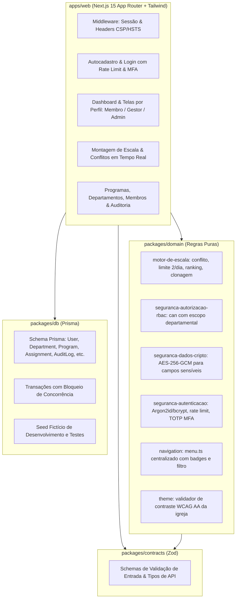

# Plano de Execução — Fase 1 (Base) [Aprovado]

**Sistema:** Revezo  
**Fase:** Fase 1 — Base  
**Status:** Aprovado para Execução  
**Objetivo:** Implementar o núcleo funcional e seguro do sistema: autenticação, perfis, autocadastro com aprovação, cadastro completo de membros, departamentos e funções, programas com clonagem, montagem manual de escala com bloqueio estrito de conflitos e limite diário (máx. 2 por dia), personalização do tema da igreja, trilha de auditoria e bateria completa de testes de segurança e domínio.

---

## 1. Visão Geral da Arquitetura e Escopo

A Fase 1 estabelece os alicerces do sistema conforme definido em `docs/roadmap.md`, `AGENTS.md` e nas regras de segurança (`.agent/rules/10` a `20`).

---

## 2. Estrutura do Monorepo (pnpm workspace)

1. **Raiz (`/`)**:
   - `package.json`: scripts unificados (`pnpm lint`, `pnpm typecheck`, `pnpm test`, `pnpm dev`, `pnpm build`).
   - `pnpm-workspace.yaml`: inclui `apps/*` e `packages/*`.
   - `tsconfig.base.json`: TypeScript estrito compartilhado.

2. **`packages/contracts/`**:
   - Schemas Zod de validação de entrada estrita (whitelist):
     - `auth.schema.ts`: login, autocadastro, recuperação, TOTP.
     - `member.schema.ts`: cadastro completo (telefones E.164, endereço, contato de emergência, batismo, canal preferido).
     - `department.schema.ts`: criação e edição de departamento e funções.
     - `program.schema.ts`: criação de programa, slots, clonagem para nova data.
     - `scheduling.schema.ts`: atribuição manual de membro a slot, recusa/remoção.
     - `church.schema.ts`: nome, logoUrl, cores primária/secundária (hex).

3. **`packages/domain/`** (Puro, sem I/O, 100% testável com Vitest):
   - `scheduling/`: `conflict.ts`, `daily-limit.ts`, `eligibility.ts`, `cloning.ts`.
   - `authz/`: `can.ts` (RBAC + escopo departamental), `sanitization.ts` (mascaramento de PII).
   - `crypto/`: `aes.ts` (AES-256-GCM).
   - `auth/`: `password.ts` (política e hash), `rate-limiter.ts`, `totp.ts`.
   - `navigation/`: `menu.ts` (conforme `docs/design/menus.md`).
   - `theme/`: `contrast.ts` (WCAG AA).

4. **`packages/db/`**:
   - `prisma/schema.prisma`: schema com índices adequados.
   - `client.ts`: singleton PrismaClient.
   - `transactions.ts`: operações com controle de concorrência.
   - `prisma/seed.ts`: seed fictício de desenvolvimento.

5. **`apps/web/`** (Next.js 15 App Router + Tailwind):
   - Design System conforme `docs/design/direcao-visual.md`, `tokens.css` e `docs/ux-copy.md`.
   - Middleware com cabeçalhos de segurança (CSP, HSTS, etc.) e gerenciamento de sessão HttpOnly.
   - Rotas: `/login`, `/cadastro`, `/` (dashboard), `/minha-escala`, `/escalas`, `/programas`, `/membros`, `/aprovacoes`, `/departamentos`, `/configuracoes`, `/auditoria`.
