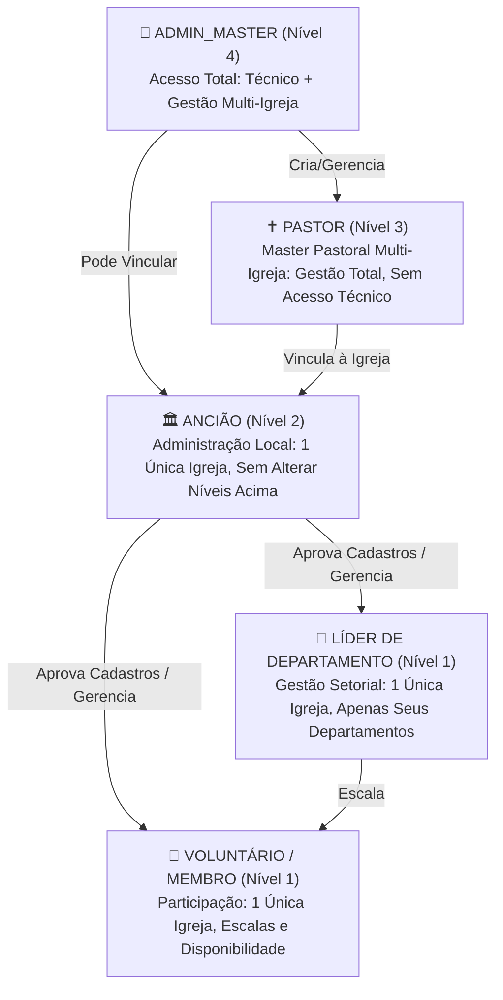

# Plano de Implementação: Arquitetura de Acessos e Multi-Igreja Hierárquica

Este documento detalha a arquitetura e o plano de implementação para a reestruturação dos logins, perfis de acesso e suporte a múltiplas congregações no **Escala Igreja**, atendendo rigorosamente aos requisitos de negócio e às diretrizes de segurança (Regras 10 a 20) e LGPD do projeto.

---

## 1. Visão Geral e Estrutura de Papéis

### 1.1 Hierarquia de Perfis e Níveis de Autoridade



### 1.2 Matriz de Responsabilidades e Limites de Acesso

| Perfil | Escopo de Igreja | Criação de Cronogramas | Aprovação de Novos Membros | Vincular Anciãos | Configurações Pastorais da Igreja | Regras Técnicas (Canais / Webhooks / Flags) | Proteção Hierárquica |
| :--- | :--- | :--- | :--- | :--- | :--- | :--- | :--- |
| **ADMIN_MASTER** | Global (todas) | Sim | Sim | Sim | Sim | **Sim (Exclusivo)** | Nível 4 (Máximo) |
| **PASTOR** | Multi-Igreja (sob seus cuidados) | Sim | Sim | **Sim** | Sim (Cores, Logo, Nome) | **Não (Bloqueado)** | Nível 3 (Pode editar seus registros e de níveis abaixo) |
| **ANCIÃO** | **1 Única Igreja** | **Sim** | **Sim** | **Não (Bloqueado)** | Apenas leitura | **Não (Bloqueado)** | Nível 2 (**Não altera** dados de Pastor/Admin) |
| **LÍDER DE DEPTO** | **1 Única Igreja** | Não (escala seus slots) | Não (ou apenas do depto) | Não | Não | Não | Nível 1 |
| **VOLUNTÁRIO** | **1 Única Igreja** | Não | Não | Não | Não | Não | Nível 1 |

---

## 2. Modelagem de Dados e Banco de Dados (Prisma)

### 2.1 Modelos de Congregação e Relações Multi-Igreja
Evolução do modelo estático de igreja única para suporte nativo a congregações particionadas:

```prisma
model Church {
  id             String         @id @default(uuid())
  name           String
  code           String         @unique
  slug           String         @unique
  city           String?
  state          String?
  primaryColor   String?        @default("#0F4C5C")
  secondaryColor String?        @default("#F2B632")
  logoUrl        String?
  active         Boolean        @default(true)
  createdAt      DateTime       @default(now())
  updatedAt      DateTime       @updatedAt

  pastors        PastorChurch[]
  eldersAndUsers User[]
  departments    Department[]
  programs       Program[]
  auditLogs      AuditLog[]
}

// Relação Many-to-Many entre Pastor e as Congregações sob seus cuidados
model PastorChurch {
  pastorId  String
  churchId  String
  createdAt DateTime @default(now())

  pastor    User     @relation(fields: [pastorId], references: [id], onDelete: Cascade)
  church    Church   @relation(fields: [churchId], references: [id], onDelete: Cascade)

  @@id([pastorId, churchId])
}
```

### 2.2 Usuário e o Enum `GlobalRole`

```prisma
enum GlobalRole {
  ADMIN_MASTER
  PASTOR
  ELDER
  USER
}

model User {
  id              String         @id @default(uuid())
  name            String
  email           String         @unique
  passwordHash    String
  globalRole      GlobalRole     @default(USER)
  status          AccountStatus  @default(PENDING)
  
  // Vínculo fixo de congregação:
  // Obrigatório para ELDER e USER (Líder/Voluntário) -> estritamente 1 congregação
  // Opcional para ADMIN_MASTER (global) e PASTOR (pastoreia múltiplas igrejas via PastorChurch)
  churchId        String?
  church          Church?        @relation(fields: [churchId], references: [id])
  pastorChurches  PastorChurch[]
  appointedById   String?
  appointedBy     User?          @relation("ElderAppointments", fields: [appointedById], references: [id])
  appointedElders User[]         @relation("ElderAppointments")
}
```

### 2.3 Rastreabilidade Hierárquica em Entidades de Gestão (`Program` e `Department`)

```prisma
model Program {
  id            String             @id @default(uuid())
  churchId      String?
  title         String
  date          DateTime
  clonedFromId  String?
  
  // Auditoria de autoria hierárquica para travas de proteção
  createdById   String?
  createdByRole GlobalRole?        // ADMIN_MASTER | PASTOR | ELDER
  
  church        Church?            @relation(fields: [churchId], references: [id])
  creator       User?              @relation(fields: [createdById], references: [id])
  departments   ProgramDepartment[]
  slots         ProgramSlot[]

  @@index([churchId, date])
}

model Department {
  id            String               @id @default(uuid())
  churchId      String?
  name          String
  createdById   String?
  createdByRole GlobalRole?

  church        Church?              @relation(fields: [churchId], references: [id])
  functions     DepartmentFunction[]
  members       DepartmentMember[]
  programs      ProgramDepartment[]
  slots         ProgramSlot[]

  @@unique([churchId, name])
}
```

---

## 3. Regras de Negócio e Camada de Domínio (`packages/domain`)

### 3.1 Níveis Hierárquicos e Regra de Imutabilidade Superior
No módulo `packages/domain/src/authz/can.ts`:

```typescript
export const ROLE_HIERARCHY_LEVEL: Record<GlobalRole, number> = {
  ADMIN_MASTER: 4,
  PASTOR: 3,
  ELDER: 2,
  USER: 1,
};

/**
 * Determina se o usuário tem nível suficiente para alterar/remover um recurso criado por outro papel.
 * Regra de Ouro: Um usuário de nível inferior JAMAIS pode alterar ou excluir dados cadastrados por níveis superiores.
 */
export function canModifyResourceByHierarchy(
  userRole: GlobalRole,
  resourceCreatedByRole?: GlobalRole | null
): boolean {
  if (!resourceCreatedByRole) return true;
  return ROLE_HIERARCHY_LEVEL[userRole] >= ROLE_HIERARCHY_LEVEL[resourceCreatedByRole];
}
```

### 3.2 Catálogo de Ações e Matriz de Permissões
- `church:switch`: Pastor e Admin alternarem a congregação ativa no cookie de contexto.
- `church:elder:assign`: Pastor e Admin nomearem voluntários ativos como Anciãos de uma igreja.
- `system:technical:manage`: Exclusivo do Admin Master (bloqueia `/canais`, webhooks e flags para Pastor e Ancião).
- `program:update` e `program:delete`: Validam se `canModifyResourceByHierarchy(user.globalRole, resource.createdByRole)` é verdadeiro.
- `program:create`: Liberado para Admin Master, Pastor e Ancião da congregação.

### 3.3 Verificação Estrita Anti-IDOR por Igreja
- Usuários `ELDER` e `USER` têm seu escopo fixado em `user.churchId`.
- Requisições que tentem passar um `churchId` divergente são rejeitadas com erro 403 Forbidden.
- O Pastor só pode operar sobre congregações contidas em sua lista de pastoreio (`pastorChurchIds`).

---

## 4. Experiência do Usuário (UI/UX no `apps/web`)

### 4.1 Seletor de Igreja para Pastor e Admin Master
- Componente `ChurchSelector` na `Navbar`:
  - Permite alternar instantaneamente entre as congregações ativas.
  - Grava a escolha no cookie seguro `active_church_id`.
  - Revalida dinamicamente o tema CSS (cores primária/secundária da igreja ativa).
  - Para Ancião, Líder e Voluntário, exibe apenas o nome fixo da sua igreja sem menu dropdown.

### 4.2 Interface do Ancião
- Acesso à gestão local: aprovação de cadastros, criação de cronogramas e gestão de departamentos locais.
- Badges visuais em programas:
  - `👑 Admin Master` ou `✝️ Pastoral` (com botões de exclusão desabilitados para proteção hierárquica).
  - `🏛️ Local` (criado localmente, permitindo edição e exclusão).

### 4.3 Gestão e Nomeação de Anciãos
- Na tela `/membros`, Pastor e Admin têm o botão **"🏛️ Tornar Ancião"** para membros ativos da congregação selecionada, chamando `/api/membros/vincular-anciao`.

### 4.4 Autocadastro de Voluntários
- O formulário `/cadastro` lista as congregações ativas via `/api/public/igrejas`, vinculando a solicitação de autocadastro à congregação correta para aprovação pelo Ancião local.

---

## 5. Roteiro de Implementação em Fases

- [x] **Fase 1: Modelagem e Banco de Dados (`packages/db`)**
  - Migration Prisma `20261001010000_multi_church_and_roles`.
  - Atualização do `schema.prisma` com `Church`, `PastorChurch`, campos `churchId`, `createdById`, `createdByRole`.
  - Atualização do `seed.ts` com congregações, Pastor multi-igreja e Anciãos.
- [x] **Fase 2: Domínio e Contratos (`@escala-igreja/domain` e `@escala-igreja/contracts`)**
  - Implementação de `ROLE_HIERARCHY_LEVEL` e `canModifyResourceByHierarchy`.
  - Matriz de testes RBAC (73 casos de teste cobrindo todas as combinações de papéis e congregações).
  - Schemas Zod de criação de congregação, nomeação de ancião e troca ativa.
- [x] **Fase 3: Camada Web e Backend (`apps/web`)**
  - Métodos `getActiveChurchContext` e rotas `/api/igrejas/alternar` e `/api/membros/vincular-anciao`.
  - Proteção anti-IDOR e isolamento nas rotas de programas, membros, departamentos e aprovações.
  - Proteção de regras técnicas (`/canais`) restrita ao Admin Master.
- [x] **Fase 4: Frontend e Navegação**
  - Componente `ChurchSelector` na `Navbar`.
  - Contextualização visual de congregação ativa no layout e cabeçalhos.
  - Badges hierárquicos em programas e membros.
- [x] **Fase 5: Testes Finais e Build**
  - 214 testes unitários e de integração passando 100%.
  - Build de produção do Next.js sem erros de tipagem.

---

## 6. Decisões Arquiteturais Vinculadas (ADRs)
- **ADR-005**: Segurança em Camadas e Autorização Centralizada.
- **ADR-016**: Hierarquia Eclesiástica, Isolamento Multi-Igreja e Proteção Hierárquica de Recursos.
