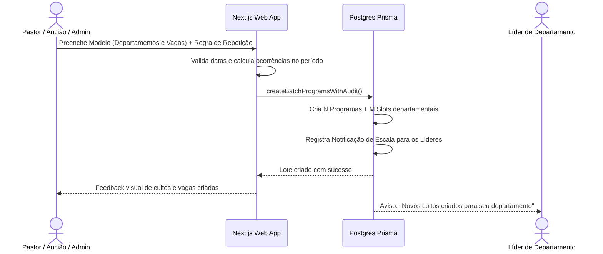
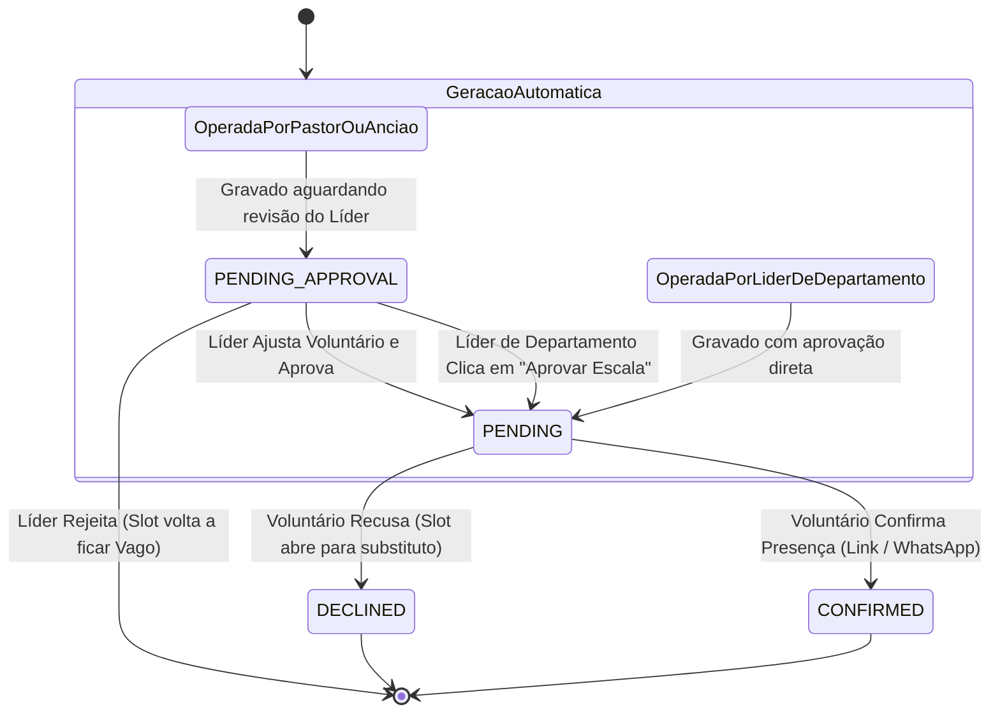

# Plano de Implementação — Programas Recorrentes, Visão em Calendário e Aprovação de Escalas

## Visão Geral e Objetivos

Este plano atende às seguintes solicitações de evolução do sistema de escalas:
1. **Visão de Calendário Mensal (Estilo Agenda / Google Calendar)**:
   - **Para a Igreja e Departamentos**: Visualização mensal da programação completa de cultos e eventos com filtro departamental (ex.: o departamento de Louvor visualiza em quais dias e cultos do mês atua).
   - **Para o Voluntário**: Visualização mensal dos seus compromissos particulares (dias em que está escalado, horários, função e status de confirmação).
2. **Criação em Massa e Recorrência de Programas**:
   - O gestor esquematiza um modelo de programa definindo quais departamentos participam e quantas pessoas/funções são necessárias em cada um (ex.: Louvor: 2 Vocal, 1 Teclado; Mídia: 1 Projeção; Recepção: 2 Recepcionistas).
   - Configura a regra de repetição (ex.: todos os sábados de um trimestre, domingos e quartas, ou uma semana inteira contínua).
   - O sistema gera todos os programas e vagas departamentais em lote.
3. **Notificação Automática aos Líderes Departamentais**:
   - Assim que os programas forem criados, os líderes dos departamentos envolvidos recebem avisos in-app e logs para montarem os cronogramas de suas equipes.
4. **Restrição Departamental na Geração Automática de Escalas**:
   - Quando um **Líder de Departamento** aciona a ferramenta de geração automática, apenas o departamento que ele lidera é apresentado e considerado para alocação.
5. **Fluxo de Pendência e Aprovação Eclesiástica (Pastor / Ancião -> Líder)**:
   - Quando um **Pastor** ou **Ancião** gera uma escala automática geral, as escalas são criadas em estado de pendência (`PENDING_APPROVAL`).
   - O voluntário **não** recebe a notificação antecipadamente.
   - O **Líder do Departamento** recebe a escala sugerida em `/aprovacoes` para revisar, ajustar o voluntário se necessário e aprovar. Apenas após a aprovação do Líder a escala é direcionada ao voluntário com o link de confirmação.

---

## Revisão de Decisões e Alertas Críticos

> [!IMPORTANT]
> **Fluxo de Aprovação Pastoral**: Quando Pastores ou Anciãos acionam a escala automática, a convocação direta do voluntário é pausada em `PENDING_APPROVAL`. Isso preserva o papel operacional e o discernimento dos líderes de departamento sobre a rotina da sua equipe. Quando o próprio Líder de Departamento gera a escala, o status já é `PENDING` (direto para o voluntário).

> [!NOTE]
> **Criação Segura em Lote**: Para proteger a estabilidade e evitar loops, a geração recorrente terá um teto de segurança de até 100 programas por comando em lote, executado em transação atômica (`$transaction`).

---

## Diagramas Arquiteturais

### Fluxo de Geração em Massa e Notificação aos Líderes


### Ciclo de Aprovação da Escala Automática


---

## Alterações Propostas (Componente a Componente)

### 1. Banco de Dados & Modelagem (`packages/db`)

#### [MODIFY] `packages/db/prisma/schema.prisma`
- Adicionar o valor `PENDING_APPROVAL` no enum `AssignmentStatus`:
  ```prisma
  enum AssignmentStatus {
    PENDING_APPROVAL
    PENDING
    CONFIRMED
    DECLINED
    SUBSTITUTED
  }
  ```
- Adicionar `recurrenceGroupId` no model `Program`:
  ```prisma
  model Program {
    id                String      @id @default(cuid())
    churchId          String?
    title             String
    date              DateTime
    clonedFromId      String?
    recurrenceGroupId String?     // ID do lote recorrente
    createdById       String?
    createdByRole     GlobalRole?
    // ...
    @@index([churchId, date])
    @@index([recurrenceGroupId])
  }
  ```
- Adicionar campos de aprovação no model `Assignment`:
  ```prisma
  model Assignment {
    // ...
    approvedById   String?
    approvedAt     DateTime?
    approver       User?       @relation("AssignmentApprover", fields: [approvedById], references: [id])
    // ...
    @@index([status])
  }
  ```

#### [MODIFY] `packages/db/src/transactions.ts`
- **`createBatchProgramsWithAudit`**:
  - Recebe modelo base do programa, horários, departamentos/funções necessárias e lista de datas.
  - Cria todos os programas e slots correspondentes.
  - Identifica os gestores dos departamentos envolvidos e cria alertas de montagem de escala.
- **`applyAutoScheduleWithLock`**:
  - Se o `actorRole` for `PASTOR` ou `ELDER` (e não for o gestor específico do departamento), define `status: 'PENDING_APPROVAL'`.
  - Se o ator for `MANAGER` do departamento, define `status: 'PENDING'` e marca aprovação imediata.
- **`approveScheduleAssignmentWithAudit`**:
  - Permite ao Líder de Departamento aprovar a escala (individual ou em lote), transitando de `PENDING_APPROVAL` para `PENDING`.
  - Gera token de ação para o voluntário receber o link de confirmação.

---

### 2. Domínio e Regras Puras (`packages/domain`)

#### [NEW] `packages/domain/src/scheduling/recurrence.ts`
- Função pura `generateRecurrenceDates(options: RecurrenceOptions): Date[]`:
  - Modos: `WEEKLY_DAYS` (ex: todo sábado e domingo) ou `DAILY_RANGE` (período contínuo).
  - Normalização de fuso horário `America/Sao_Paulo`.
  - Trava de segurança: limite de 100 datas por lote.

#### [MODIFY] `packages/domain/src/authz/can.ts`
- Adicionar verificação para `schedule:approve`:
  - `MANAGER` pode aprovar escalas do seu departamento.
  - `PASTOR`, `ELDER` e `ADMIN_MASTER` podem aprovar da sua congregação.

---

### 3. Contratos de API e Schemas Zod (`packages/contracts`)

#### [MODIFY] `packages/contracts/src/program.schema.ts`
- Adicionar `createBatchProgramsSchema`:
  - Validação de título, horários início/fim, departamentos com funções e vagas.
  - Validação da regra de recorrência (`WEEKLY_DAYS` ou `DAILY_RANGE`, data inicial e data final).

#### [MODIFY] `packages/contracts/src/assignment.schema.ts`
- Adicionar `approveScheduleSchema`:
  - `{ assignmentIds: string[], notes?: string }`.
- Adicionar `adjustAndApproveScheduleSchema`:
  - `{ assignmentId: string, newUserId: string }`.

---

### 4. Componente de Calendário Mensal Reutilizável (`apps/web`)

#### [NEW] `apps/web/src/components/CalendarMonthView.tsx`
- Componente elegante, tátil e acessível (WCAG AA):
  - Cabeçalho com navegação mês a mês (`◀ Mês Anterior`, `Mês/Ano`, `Hoje`, `Próximo Mês ▶`).
  - Dropdown integrado para filtro por departamento.
  - Grade de 7 dias (Dom a Sáb) com números dos dias e marcação do dia atual.
  - Renderização de badges de eventos/cultos/escalas por dia.
  - Ao clicar em um dia ou evento, abre drawer/modal com a programação e detalhes completos.
  - Visão mobile responsiva otimizada para toque (mínimo 44px).

---

### 5. Aplicação Web Next.js (`apps/web`)

#### [MODIFY] `apps/web/src/app/programas/page.tsx` & `ProgramasClient.tsx`
- **Alternância de Visualização**:
  - Botão de alternância `[ 📋 Lista de Cultos ] [ 📅 Calendário Mensal ]`.
  - No modo Calendário: exibe todos os cultos do mês com filtro por departamento, permitindo ver em quais dias cada departamento atua.
- **Modal de Criação com Recorrência em Massa**:
  - Aba 1: Culto Avulso (único).
  - Aba 2: Programas Recorrentes em Massa:
    - Definição dos departamentos e quantidade de pessoas/funções por departamento.
    - Seletor de recorrência (dias da semana ou período).
    - Prévia em tempo real das datas e total de vagas geradas.
    - Botão de confirmação com geração em lote.

#### [MODIFY] `apps/web/src/app/minha-escala/page.tsx` & `MinhaEscalaClient.tsx`
- **Alternância de Visualização para o Voluntário**:
  - Botão `[ 📋 Lista de Escalas ] [ 📅 Meus Compromissos no Mês ]`.
  - O voluntário visualiza o calendário mensal com destaque apenas nos dias em que ele está escalado, com horários, departamento, função e status de confirmação.

#### [MODIFY] `apps/web/src/app/escalas/EscalasClient.tsx` & `/api/escalas/gerar-preview`
- **Restrição Departamental para Líderes**:
  - Se o usuário for Líder de Departamento, a modal de escala automática já abre travada no seu departamento, exibindo apenas as vagas da sua equipe.
- **Avisos de Pendência**:
  - Exibe badge `⏳ Aguardando Aprovação do Líder` em escalas geradas por Pastores/Anciãos.

#### [MODIFY] `apps/web/src/app/aprovacoes/page.tsx` & `AprovacoesClient.tsx`
- **Aba 1: Novos Cadastros** (existente).
- **Aba 2: Escalas Pendentes de Aprovação**:
  - Lista as escalas sugeridas pelo algoritmo em cultos gerados pela liderança eclesiástica.
  - Ações para o Líder:
    - **✓ Aprovar Escala** (dispara confirmação ao voluntário).
    - **✏️ Ajustar Voluntário** (troca antes de aprovar).
    - **✕ Rejeitar Atribuição** (deixa o slot aberto).
    - **✓ Aprovar Todas as Escalas Deste Culto** (em lote).

---

## Plano de Verificação

### Testes Automatizados
- Testes unitários de cálculo de recorrência em `packages/domain/test/recurrence.test.ts`.
- Testes da matriz de autorização para aprovação de escalas em `packages/domain/test/schedule-approval.test.ts`.
- Validação dos contratos Zod em `packages/domain/test/program-contracts.test.ts`.
- Execução: `pnpm test` (garantindo que os 269 testes existentes continuem passando + novos testes).

### Build e Tipagem
- `pnpm -r build` e `pnpm --filter @escala-igreja/web build` para validar compilação estática de todas as páginas e rotas.

### Verificação Manual
1. **Criar Programas em Massa**:
   - Entrar como Pastor ou Admin e criar cultos para todos os sábados e domingos do próximo mês definindo Louvor (2 vagas) e Mídia (1 vaga).
2. **Visualizar no Calendário**:
   - Alternar para a visão de Calendário em `/programas` e filtrar por Louvor.
3. **Gerar Escala Automática como Pastor**:
   - Gerar a escala automática e verificar que as escalas são criadas em `PENDING_APPROVAL`.
4. **Aprovar como Líder de Departamento**:
   - Fazer login como Líder do Louvor (`gestor.louvor@igreja.local`).
   - Acessar `/aprovacoes` -> Aba "Escalas Pendentes".
   - Aprovar a escala e verificar que ela passa para `PENDING` para o voluntário.
5. **Verificar no Calendário do Voluntário**:
   - Entrar como o voluntário escalado e verificar seus compromissos no calendário mensal de `/minha-escala`.
